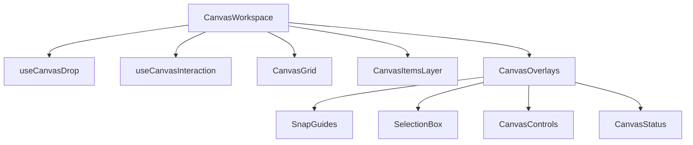

# Refactoring Plan: CanvasWorkspace

## Goal
Reduce `CanvasWorkspace.tsx` complexity from ~700 lines to <300 lines by extracting UI components and logic hooks, adhering to [Component Best Practices](COMPONENT_BEST_PRACTICES.md).

## Current State analysis
`CanvasWorkspace` currently is a "God Component" that handles:
1.  **Layout & Rendering**: Grid, Items loop, Layer management, Fixed UI Overlays.
2.  **Interaction Logic**: Pan/Zoom mouse events, Drag & Drop (creation), Keyboard shortcuts, Wheel events.
3.  **Local State**: Panning state, snap guides state, UI toggle states.

## Proposed Architecture

## Implementation Steps

### Phase 1: Extract UI Overlays (High Impact, Low Risk)
Create `CanvasOverlays` component to encapsulate all fixed UI elements (Z-Index layer 2).
- **Source**: `CanvasWorkspace.tsx` lines ~500-720 (The entire overlay div).
- **Target**: `src/components/canvas/CanvasOverlays.tsx`
- **Props Needed**: 
    - `canvasTransform`, `zoom`
    - `snapGuides`, `shapeSnapGuides`
    - `selectionBox`, `multiSelect`
    - `activeDragRect`, `lockedAxis`, `isShiftPressed`
    - `items` (count for status), `debugInfo`
    - Interaction callbacks (`onZoom`, `onToggleTheme`, etc.)
- **Est. Reduction**: ~200 lines.

### Phase 2: Extract Drop Logic (Medium Impact)
Move the `handleDrop` logic (creating shapes/text from toolbar drag) to a custom hook.
- **Source**: `handleDrop` function and `onDragOver` handler.
- **Target**: `src/hooks/useCanvasDrop.ts`
- **Responsibilities**: 
    - Handle `dragover` prevention.
    - Parse dropped data (tool type).
    - Create new item objects (Shapes, Text).
    - Call `onItemAdd`.
- **Est. Reduction**: ~60 lines.

### Phase 3: Extract Item Layer (Medium Impact)
Move the loop that iterates and renders individual canvas items.
- **Source**: `items.map(...)` rendering logic.
- **Target**: `src/components/canvas/CanvasItemsLayer.tsx`
- **Props**: `items`, `renderItem`, `transformState`, etc.
- **Est. Reduction**: ~50 lines.

### Phase 4: Helper Components
Extract smaller UI parts if necessary:
- `CanvasControls`: The bottom-right zoom/theme controls (already partly componentized).
- `CanvasStatus`: The top-left status chips.

## Execution Order
1.  **Create `CanvasOverlays`**: This isolates the "view" logic of the HUD from the workspace logic.
2.  **Create `useCanvasDrop`**: This isolates the creation logic.
3.  **Review Size**: Check if `< 300` lines. If not, proceed to Phase 3.

## Risk Assessment
- **Prop Drilling**: `CanvasOverlays` will require many props. Consider grouping them into a `CanvasUIState` object or similar if the list gets too long.
- **Z-Index**: Ensure extracted components maintain the correct Z-stacking order (Grid -> Items -> Selection -> Overlays).

## Next Reference
- [Component Best Practices](COMPONENT_BEST_PRACTICES.md)
